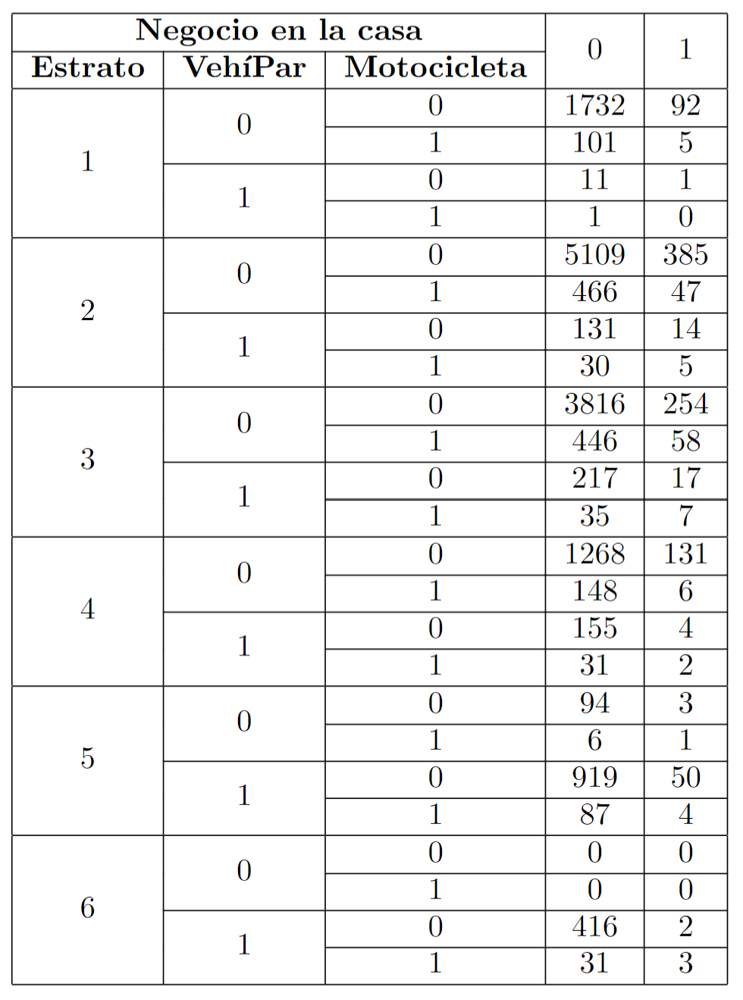

```{r setup, include=FALSE, warning=FALSE}
knitr::opts_chunk$set(echo = F, fig.width=8, fig.height=4)
```

\section{Punto 2.}
La Encuesta de calidad de vida 2007 presenta información sobre si en un hogar tienen vehículo particular (0:No y 1:Sí), si tienen motocicleta y si tienen algún negocio en la casa además del estrato. La información se presenta en la siguiente tabla. Realice un análisis descriptivo.

{#id .class height=450}

La Encuesta de Calidad de Vida es un instrumento diseñado para realizar el seguimiento y la medición de las condiciones socioeconómicas de los habitantes de una zona, los datos tomados proporcionan información estratégica sobre las condiciones de vida de los colombianos incluyendo variables relacionadas con la vivienda (material de paredes, pisos y servicios públicos), las personas para los que se incluyen variables de: educación, salud, cuidado de los niños, fuerza de trabajo, gastos e ingresos, etc., y los hogares que involucra variables como: tenencia de bienes y percepción del jefe o del cónyuge sobre las condiciones de vida en el hogar.

\vspace{1cm}

En este caso particular, se tendran en cuenta las siguientes variables:

 - **Estrato:** Forma en la que, en la mayoría de los países del mundo, clasifican a los hogares a través de diferentes criterios basados en las condiciones de la vivienda en la que dicho grupo de personas habita y el entorno o zona en la que esta se encuentra.
 - **VehíPar:** Posee o no posee vehículo partícular (Si: 1, No: 0).
 - **Motocicleta:** Posee o no posee motocicleta (Si: 1, No: 0).
 - **Negocio en la casa:** Psee o no posee negocio en la casa (Si: 1, No: 0).
 
\vspace{0.5cm}

Para dar un mejor entendimiento a la tabla anterior, la cual se encuentra colapsada en forma de resumen, se presentaran los datos por estrato de la siguiente manera, la cual nos permitirá un análisis a nivel univariado:


\begin{table}[h!]
\centering
\begin{tabular}{|c|c|}
\hline
\textbf{Estrato} & \textbf{Hogares Entrevistados} \\ \hline
\textbf{1}       & 1943                           \\ \hline
\textbf{2}       & 6187                           \\ \hline
\textbf{3}       & 4850                           \\ \hline
\textbf{4}       & 1745                           \\ \hline
\textbf{5}       & 1164                           \\ \hline
\textbf{6}       & 452                            \\ \hline
\end{tabular}
\end{table}

Se puede observar que el número de hogares entrevistados es considerablemente mayor en los estratos 2 y 3. Esto puede deberse a que en general, la mayor parte de la población Colombiana hace parte de estos subgrupos, además de estar más dispuestos a dar información de caracter privado como es esta.

\vspace{1cm}

El número de entrevistados en el estrato 1, posiblemente se deba a que dichos hogares se encuentran en zonas de difícil acceso, por lo cual se deba destinar más presupuesto por cada unidad que se desea encuestar. 

\begin{table}[h!]
\centering
\begin{tabular}{|c|c|c|}
\hline
\textbf{Estrato 1}           & \textbf{SI} & \textbf{NO} \\ \hline
\textbf{Vehículo Particular} & 13          & 1930        \\ \hline
\textbf{Motocicleta}         & 107         & 1836        \\ \hline
\textbf{Negocio en casa}     & 98          & 1845        \\ \hline
\end{tabular}
\end{table}
 
\begin{table}[h!]
\centering
\begin{tabular}{|c|c|c|}
\hline
\textbf{Estrato 2}           & \textbf{SI} & \textbf{NO} \\ \hline
\textbf{Vehículo Particular} & 180         & 6007        \\ \hline
\textbf{Motocicleta}         & 548         & 5639        \\ \hline
\textbf{Negocio en casa}     & 451         & 5736        \\ \hline
\end{tabular}
\end{table}

\begin{table}[h!]
\centering
\begin{tabular}{|c|c|c|}
\hline
\textbf{Estrato 3}           & \textbf{SI} & \textbf{NO} \\ \hline
\textbf{Vehículo Particular} & 276         & 4574        \\ \hline
\textbf{Motocicleta}         & 546         & 4304        \\ \hline
\textbf{Negocio en casa}     & 336         & 4514        \\ \hline
\end{tabular}
\end{table}

\begin{table}[h!]
\centering
\begin{tabular}{|c|c|c|}
\hline
\textbf{Estrato 4}           & \textbf{SI} & \textbf{NO} \\ \hline
\textbf{Vehículo Particular} & 192         & 1553        \\ \hline
\textbf{Motocicleta}         & 187         & 1558        \\ \hline
\textbf{Negocio en casa}     & 143        & 1602         \\ \hline
\end{tabular}
\end{table}

\begin{table}[h!]
\centering
\begin{tabular}{|c|c|c|}
\hline
\textbf{Estrato 5}           & \textbf{SI} & \textbf{NO} \\ \hline
\textbf{Vehículo Particular} & 1060        & 104         \\ \hline
\textbf{Motocicleta}         & 98          & 1066        \\ \hline
\textbf{Negocio en casa}     & 58        & 1106          \\ \hline
\end{tabular}
\end{table}

\begin{table}[h!]
\centering
\begin{tabular}{|c|c|c|}
\hline
\textbf{Estrato 6}           & \textbf{SI} & \textbf{NO} \\ \hline
\textbf{Vehículo Particular} & 452         & 0           \\ \hline
\textbf{Motocicleta}         & 34          & 418         \\ \hline
\textbf{Negocio en casa}     & 5           & 447         \\ \hline
\end{tabular}
\end{table}

\newpage

\vspace{1cm}

El análisis descriptivo se iniciará análizando cada variable, discriminando por estrato:

```{r}
datos_p2 <- data.frame("Estrato"= as.factor(c(rep(1,1943), rep(2,6187), rep(3,4850),
                                   rep(4,1745), rep(5,1164), rep(6,452))),
                       "VehiculoP"=c(rep("SI",13), rep("NO",1930),
                                     rep("SI",180), rep("NO",6007),
                                     rep("SI",276), rep("NO",4574),
                                     rep("SI",192), rep("NO",1553),
                                     rep("SI",1060), rep("NO",104),
                                     rep("SI",452)),
                       "Motocicleta"=c(rep("SI",107), rep("NO",1836),
                                       rep("SI",548), rep("NO",5639),
                                       rep("SI",546), rep("NO",4304),
                                       rep("SI",187), rep("NO",1558),
                                       rep("SI",98), rep("NO",1066),
                                       rep("SI",34), rep("NO",418)),
                       "NegocioCasa"=c(rep("SI",98), rep("NO",1845),
                                       rep("SI",451), rep("NO",5736),
                                       rep("SI",336), rep("NO",4514),
                                       rep("SI",143), rep("NO",1602),
                                       rep("SI",58), rep("NO",1106),
                                       rep("SI",5), rep("NO",447)))
```

```{r, warning=FALSE}
library(ggplot2)
library(scales)

g1 = ggplot(datos_p2, aes(Estrato, fill=VehiculoP) ) +
  xlab("Estrato") + ylab("Frecuencia \n Porcentaje por Estrato") +
  theme(plot.title = element_text(size = rel(2)))

Hogares <- c(1943,6187,4850,1745,1164,452)
Psi <- c(13,180,276,192,1060,452)/Hogares
PNo <- c(1930,6007,4574,1553,104,0)/Hogares

g1 + geom_bar() + 
  scale_fill_discrete(name = "Posee VP", labels = c("NO", "SI")) +
  theme(axis.text.x = element_text(angle = -45, vjust = 1, hjust=-0.3)) +
  theme_linedraw() +                                                      
  theme(legend.position = "right") +                                    
  facet_grid(~"Hogares con Vehículo Particular (VP)") +
  coord_flip()
```

Un dato importante que refleja la gráfica anterior, es que a medida que el estrato aumenta, la proporción de hogares que poseen vehículo partícular tambien aumenta. Hecho que es de esperarse, pues, las condiciones de vida especificamente son mejores en estratos más altos, teniendo mayores ingresos mensuales y con ello la posibilidad de adquirir vehículos para su transporte.

```{r, warning=FALSE}
g2 = ggplot(datos_p2, aes(Estrato, fill=Motocicleta) ) +
  xlab("Estrato") + ylab("Frecuencia \n Porcentaje por Estrato") +
  theme(plot.title = element_text(size = rel(2)))

Hogares <- c(1943,6187,4850,1745,1164,452)
Psi <- c(107,548,546,187,98,34)/Hogares
PNo <- c(1836,5639,4304,1558,1066,418)/Hogares

g2 + geom_bar() + 
  scale_fill_discrete(name = "Posee M", labels = c("NO", "SI")) +
  theme(axis.text.x = element_text(angle = -45, vjust = 1, hjust=-0.3)) +
  theme_linedraw() +                                                      
  theme(legend.position = "right") +                                    
  facet_grid(~"Hogares con Motocicleta (M)") +
  coord_flip()
```

La Motocicleta se ha convertido en un medio de transporte utilitario popular entre los estratos más vulnerables debido a que es mucho más económico que un automóvil y cumple con las necesadides del consumidor. Pese a lo anterior, se puede observar que solo el 5.5%, el 8.9% y el 11.3% de los hogares de los estratos 1, 2 y 3 respectivamente poseen motocicleta. Es decir, la mayor parte de los hogares de estratos bajos no cuenta con los recursos suficientes para adquirir una moto. Hecho que nos puede llevar a análizar factores sociales y ecónomicos de la región donde see llevó a cabo el estudio, pues esto puede reflejar una carencia de ingresos mínimos en los hogares de dichas zonas. 

\vspace{0.5cm}

También, la gráfica ilustra que en hogares de estratos altos, las motocicletas no son tan populares como lo son los vehículos partículares. Por ejemplo, en el estrato 6, pese a que todos los hogares entrevistados poseen vehículo partícular, solo el 7.5% posee también motocicleta. 

```{r, warning=FALSE}
g3 = ggplot(datos_p2, aes(Estrato, fill=NegocioCasa) ) +
  xlab("Estrato") + ylab("Frecuencia \n Porcentaje por Estrato") +
  theme(plot.title = element_text(size = rel(2)))

Hogares <- c(1943,6187,4850,1745,1164,452)
Psi <- c(98,451,336,143,58,5)/Hogares
PNo <- c(1845,5736,4514,1602,1106,447)/Hogares

g3 + geom_bar() + 
  scale_fill_discrete(name = "Posee NC", labels = c("NO", "SI")) +
  theme(axis.text.x = element_text(angle = -45, vjust = 1, hjust=-0.3)) +
  theme_linedraw() +                                                      
  theme(legend.position = "right") +                                    
  facet_grid(~"Hogares con Negocio en Casa (NC)") +
  coord_flip()
```

El consolidar algún negocio en casa, se ha convertido en una tendencia a la cual más hogares están considerando llevar a la practica. El hecho de no tener que pagar un arriendo extra o no tener la necesidad de desplazarse a otro lugar pueden ser cualidades a favor que está opción muestra.

La gráfica indica que la mayor parte de los hogares no poseen negocios en casa. Un motivo de esto, puede ser que la mayor parte de la población sean empleados de empresas o en el caso de estratos bajos, posean empleos informales y por ello no tengan un negocio propio.

\vspace{0.5cm}

En este punto, vale la pena análizar las variables de Vehículo Particular (VP) y Motocicleta (M) conjuntamente.

Los datos se resumen en la siguiente tabla:

\begin{table}[h!]
\centering
\begin{tabular}{|c|c|c|c|c|}
\hline
\textbf{Estrato} & \textbf{VP} & \textbf{M} & \textbf{VP y M} & \textbf{Ninguno} \\ \hline
\textbf{1}       & 12          & 106        & 1               & 1824             \\ \hline
\textbf{2}       & 145         & 513        & 35              & 5494             \\ \hline
\textbf{3}       & 234         & 504        & 42              & 4070             \\ \hline
\textbf{4}       & 159         & 154        & 33              & 1399             \\ \hline
\textbf{5}       & 969         & 7          & 91              & 97               \\ \hline
\textbf{6}       & 418         & 0          & 34              & 0                \\ \hline
\end{tabular}
\end{table}

```{r}
datos_p2vehi <- data.frame("Estrato"= as.factor(c(rep(1,1943), rep(2,6187), rep(3,4850),
                                   rep(4,1745), rep(5,1164), rep(6,452))),
                       "Posee"=c(rep("VP",12), rep("M",106), rep("VP y M",1), rep("Ninguno",1824),
                                 rep("VP",145), rep("M",513), rep("VP y M",35), rep("Ninguno",5494),
                                 rep("VP",234), rep("M",504), rep("VP y M",42), rep("Ninguno",4070),
                                 rep("VP",159), rep("M",154), rep("VP y M",33), rep("Ninguno",1399),
                                 rep("VP",969), rep("M",7), rep("VP y M",91), rep("Ninguno",97),
                                 rep("VP",418), rep("VP y M",34)))

est1 <- c(12,106,1,1824)
est2 <- c(145,513,35,5494)
est3 <- c(234,504,42,4070)
est4 <- c(159,154,33,1399)
est5 <- c(969,7,91,97)
est6 <- c(418,0,34,0)
dprop <- data.frame("Est1"=est1/1943, "Est2"=est2/6187, "Est3"=est3/4850, "Est4"=est4/1745,
                    "Est5"=est5/1164, "Est6"=est6/452)*100
```

\vspace{0.5cm}

El siguiente gráfico muestra los hogares encuestados por estrato VS. la frecuencia de si tiene moto (M), vehículo partícular (VP), vehículo particular y moto (VP y M) o ninguno. 

```{r, warning=FALSE, message=FALSE}
library(viridis)

g4 = ggplot(datos_p2vehi, aes(Estrato, fill=Posee) ) +
  xlab("Estrato") + ylab("Frecuencia \n Porcentaje por Estrato") +
  theme(plot.title = element_text(size = rel(2)))

Hogares <- c(1943,6187,4850,1745,1164,452)
Psi <- c(98,451,336,143,58,5)/Hogares
PNo <- c(1845,5736,4514,1602,1106,447)/Hogares

g4 + geom_bar(position=position_dodge()) + 
  scale_fill_brewer(name = "Posee", labels = c("M", "Ninguno", "VP", "VP y M"), palette="Paired") +
  theme(axis.text.x = element_text(angle = -45, vjust = 1, hjust=-0.3)) +
  theme_linedraw() +                                                      
  theme(legend.position = "right") +                                    
  facet_grid(~"Hogares con Vehículo Particular (VP) y/o Motocicleta (M)") +
  coord_flip()
```

En general, en los estratos 1, 2, 3 y 4, la amplia mayoría de hogares no cuenta con ningun vehículo. Las motocicletas tienen una participación mayor en comparación con los vehículos particulares y muy pocos hogares cuentan con ambas clases de vehículos.

Por otra parte, para el estrato 5, la mayor parte de los hogares cuentan con vehículo particular. Existen muy pocos hogares los cuales solo cuentan con motocicleta. 

Se aprecia un cambio drástico a partir del estrato 5 con los estratos anteriores: En promedio, en los estratos 1, 2, 3 y 4, el 86.7% de los hogares no poseen ningun vehículo propio para transporte. Mientras que en los estratos 5 y 6, en promedio, solo el 4.2% 
no cuenta con algún vehículo. Este hecho, denota una separación clara de clases sociales.

\vspace{0.5cm}

Para finalizar, se analizarán los hogares con negocio en casa y si estos cuentan o no con algún tipo de vehículo.

A continuación, se presenta una tabla de resumen para este caso:

 - **NC**: Cuenta con negocio en casa.
 - **V**: Cuenta con algún vehículo.

\begin{table}[h!]
\centering
\begin{tabular}{|c|c|c|c|c|}
\hline
\textbf{Estrato} & \textbf{NC con V} & \textbf{NC sin V} & \textbf{No NC con V} & \textbf{No NC sin V} \\ \hline
\textbf{1}       & 6                 & 92                & 113                  & 1732                 \\ \hline
\textbf{2}       & 66                & 385               & 627                  & 5109                 \\ \hline
\textbf{3}       & 82                & 254               & 698                  & 3816                 \\ \hline
\textbf{4}       & 12                & 131               & 334                  & 1268                 \\ \hline
\textbf{5}       & 55                & 3                 & 1012                 & 94                   \\ \hline
\textbf{6}       & 5                 & 0                 & 447                  & 0                    \\ \hline
\end{tabular}
\end{table}

\vspace{0.5cm}

De las gráficas se puede observar que el hecho de que los hogares posean un negocio en casa, no quiere decir que tambien posean algún tipo de vehículo. Es decir, a primera vista, las variables Negocio en casa y Motocicleta y VehíPar no tienen una correlación fuerte.

Se observa que en los estratos 1, 2, 3 y 4, la gran mayoría de hogares no poseen algún tipo de vehículo, sea particular o motocicleta y separando por los hogares que tienen negocio en casa y los que no.

A partir del estrato 5 se nota claramente un aumento en la proporción de hogares que poseen algún tipo de vehículo, ya sea que tengan un negocio en casa o no.

En general, solo el 6.7% de la población entrevistada tienen un negocio en sus hogares, y de ese subgrupo, el 20.7% posee algún tipo de vehículo.

```{r, echo=FALSE, warning=FALSE, message=FALSE}
library(ggpubr)

Est1NC <- data.frame("Posee_NC" = c(rep("SI",98),rep("NO",1845)),
                     "caracteristica" = c(rep("con V",6), rep("sin V",92),
                                          rep("con V",113), rep("sin V",1732)))

Est2NC <- data.frame("Posee_NC" = c(rep("SI",451),rep("NO",5736)),
                     "caracteristica" = c(rep("con V",66), rep("sin V",385),
                                          rep("con V",627), rep("sin V",5109)))

Est3NC <- data.frame("Posee_NC" = c(rep("SI",336),rep("NO",4514)),
                     "caracteristica" = c(rep("con V",82), rep("sin V",254),
                                          rep("con V",698), rep("sin V",3816)))

Est4NC <- data.frame("Posee_NC" = c(rep("SI",143),rep("NO",1602)),
                     "caracteristica" = c(rep("con V",12), rep("sin V",131),
                                          rep("con V",334), rep("sin V",1268)))

Est5NC <- data.frame("Posee_NC" = c(rep("SI",58),rep("NO",1106)),
                     "caracteristica" = c(rep("con V",55), rep("sin V",3),
                                          rep("con V",1012), rep("sin V",94)))

Est6NC <- data.frame("Posee_NC" = c(rep("SI",5),rep("NO",447)),
                     "caracteristica" = c(rep("con V",5),
                                          rep("con V",447)))


g5 = ggplot(Est1NC, aes(Posee_NC, fill=caracteristica) ) +
  xlab("NC") + ylab("Frecuencia \n Porcentaje por categoría") +
  theme(plot.title = element_text(size = rel(2)))

g6 = ggplot(Est2NC, aes(Posee_NC, fill=caracteristica) ) +
  xlab("NC") + ylab("Frecuencia \n Porcentaje por categoría") +
  theme(plot.title = element_text(size = rel(2)))

g7 = ggplot(Est3NC, aes(Posee_NC, fill=caracteristica) ) +
  xlab("NC") + ylab("Frecuencia \n Porcentaje por categoría") +
  theme(plot.title = element_text(size = rel(2)))

g8 = ggplot(Est4NC, aes(Posee_NC, fill=caracteristica) ) +
  xlab("NC") + ylab("Frecuencia \n Porcentaje por categoría") +
  theme(plot.title = element_text(size = rel(2)))

g9 = ggplot(Est5NC, aes(Posee_NC, fill=caracteristica) ) +
  xlab("NC") + ylab("Frecuencia \n Porcentaje por categoría") +
  theme(plot.title = element_text(size = rel(2)))

g10 = ggplot(Est6NC, aes(Posee_NC, fill=caracteristica) ) +
  xlab("NC") + ylab("Frecuencia \n Porcentaje por categoría") +
  theme(plot.title = element_text(size = rel(2)))

a <- g5 + geom_bar(position=position_dodge()) + 
  scale_fill_brewer(name = "V", labels = c("SI", "NO"), palette="Paired") +
  theme(axis.text.x = element_text(angle = -45, vjust = 1, hjust=-0.3)) +
  theme_linedraw() +                                                      
  theme(legend.position = "right") +                                    
  facet_grid(~"Estrato 1")

b <- g6 + geom_bar(position=position_dodge()) + 
  scale_fill_brewer(name = "V", labels = c("SI", "NO"), palette="Paired") +
  theme(axis.text.x = element_text(angle = -45, vjust = 1, hjust=-0.3)) +
  theme_linedraw() +                                                      
  theme(legend.position = "right") +                                    
  facet_grid(~"Estrato 2")

c <- g7 + geom_bar(position=position_dodge()) + 
  scale_fill_brewer(name = "V", labels = c("SI", "NO"), palette="Paired") +
  theme(axis.text.x = element_text(angle = -45, vjust = 1, hjust=-0.3)) +
  theme_linedraw() +                                                      
  theme(legend.position = "right") +                                    
  facet_grid(~"Estrato 3")

d <- g8 + geom_bar(position=position_dodge()) + 
  scale_fill_brewer(name = "V", labels = c("SI", "NO"), palette="Paired") +
  theme(axis.text.x = element_text(angle = -45, vjust = 1, hjust=-0.3)) +
  theme_linedraw() +                                                      
  theme(legend.position = "right") +                                    
  facet_grid(~"Estrato 4")

e <- g9 + geom_bar(position=position_dodge()) + 
  scale_fill_brewer(name = "V", labels = c("SI", "NO"), palette="Paired") +
  theme(axis.text.x = element_text(angle = -45, vjust = 1, hjust=-0.3)) +
  theme_linedraw() +                                                      
  theme(legend.position = "right") +                                    
  facet_grid(~"Estrato 5")

f <- g10 + geom_bar(position=position_dodge()) + 
  scale_fill_brewer(name = "V", labels = c("SI", "NO"), palette="Paired") +
  theme(axis.text.x = element_text(angle = -45, vjust = 1, hjust=-0.3)) +
  theme_linedraw() +                                                      
  theme(legend.position = "right") +                                    
  facet_grid(~"Estrato 6")


graf <- ggarrange(a, b, c, d, e, f, ncol = 2)

graf$`1`
graf$`2`
graf$`3`
```

