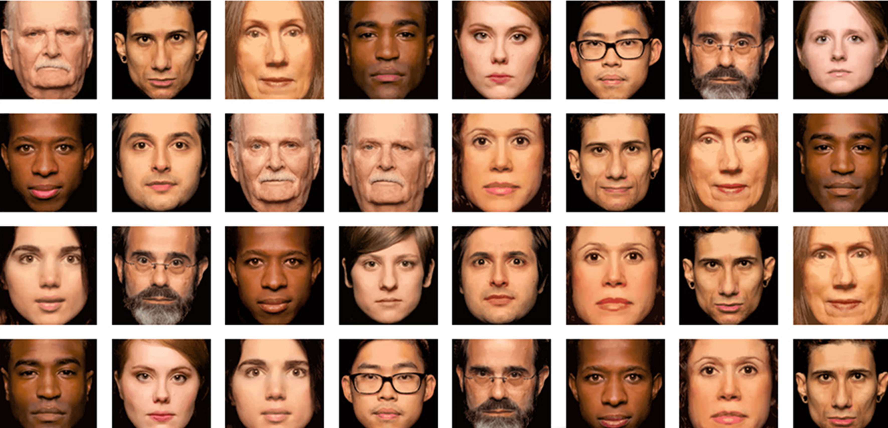

```{r setup, include=FALSE, warning=FALSE}
knitr::opts_chunk$set(echo = F, fig.width=8, fig.height=4)
```

\section{Punto 4.}

**Rostros atractivos según la ciencia:**

Tendemos a juzgar, de manera inconsciente, a todo aquel que se cruza en nuestro camino y su aspecto físico influye en la “etiqueta final” que le colocamos. Una tarea que realizamos, según Alexander Todorov, de la Universidad de Princeton, en menos de 100 milisegundos.

El rostro es la parte del cuerpo que más llama la atención a nuestro cerebro, por una cuestión de supervivencia y también de afiliación. Y es que,  estamos programados genéticamente para ver e interpretar las caras de los demás.

Los estudios señalan que no solo la apariencia facial influye en que alguien nos vea como más dominantes, creíbles o competentes, sino que, a la hora de resultar más atractivos, la cara “más bonita” tiende a manifestar unos rasgos determinados.

A pesar de que la belleza es un concepto inherente a cada cultura, la simetría facial parece que juega un papel fundamental en todas las sociedades.

Cuánto más simétricos es el rostro más atractivo nos resulta.

Entre otras cosas porque desde una perspectiva biológico-evolutiva, la simetría facial es un “certificado de salud”, algo así como un sello de calidad genética que nos indica el buen estado de del que goza la otra persona, su buena adaptación al medio e incluso su buena capacidad de “procrear” una mejor descendencia.

Ese es el motivo por el cual nuestro instinto natural hace que nos decantemos por esa cara “sana”. Por supuesto no existe un rostro simétrico cien por cien, en el que el lado izquierdo y derecho sean iguales, pero el cerebro humano lo lee como si tuvieran similares proporciones.

Tal vez por esto, el uso de las mascarillas ha hecho que, en estos tiempos pandémicos, todos seamos percibidos como más guapos. Al ocultar tres cuartas partes del rostro, el cerebro rellena los huecos que no puede ver y tiende a atribuirles una simetría en los rasgos faciales, quizá inexistente. Es lo que se comprobó en el estudio realizado este pasado mes de agosto en la Universidad de Pensilvania, en el que 496 personas tuvieron que evaluar el atractivo de hombres y mujeres a través de 60 fotografías, en las que aparecían con y sin mascarilla. 

La ingesta de alcohol también influye en la percepción facial. De ahí que con varias copas de más en el cuerpo todo el mundo parece que gana puntos extra en atractivo y belleza. 

Más allá de la simetría, hay otros aspectos que también tenemos en cuenta:

- Rostros simétricos.
- Rostros promedio.
- Rostros familiares.
- Rostros alegres.

Por un lado, preferimos los rostros convencionales, es decir, aquellos que no sobresalen del promedio y por otro, también aquellos que tienden a parecerse más a nosotros o a los que vemos con mayor asiduidad. 

En conclusión la familiaridad de una cara puede ser igual o a veces incluso más importante que la simetría a la hora de valorar su atractivo. Es lo que desde la psicología se conoce como “el efecto de mera exposición” o “principio de familiaridad”. Un curioso fenómeno del que habló por primera vez el psicólogo norteamericano, R.B. Zajonc en 1968 y que viene a decirnos que cuanto más nos exponemos a un estímulo, más nos gusta. Y sino, haga memoria y recuerde aquella persona con la que mantiene ahora una relación constante en el tiempo y que al inicio de conocerla le pareció más fea más de lo que ahora le parece.

Y por supuesto, las caras alegres también nos atraen. A nadie le gusta pasar tiempo con alguien que mantiene permanentemente el ceño fruncido, achica los ojos y tiene cara de pocos amigos. De ahí que la preferencia por determinadas facciones faciales, no solo se circunscriba a contextos sexuales, sino que también juega su papel a la hora de buscar amigos o interrelacionarnos.

\vspace{1cm}

**Toma de datos:**

Según las indicaciones del profesor, se pidió encuestar a 10 personas, entre ellas 5 mujeres y 5 hombres, con el proposito de juzgar 50 fotografias de rostros de personas (25 hombres y 25 mujeres) y decir si esta les parece atractiva o no.

{#id .class height=300}

Las fotografías utilizadas para el experimento, se encuentran en el apendice, al final del documento. 

Las personas encuestadas se eligieron al azar de una lista de contacto entre los autores de este trabajo.

Se les contacto con un tiempo prudente y se acordó un horario disponible para cada uno. Inicialmente se les explicó la metodología y todos los participantes mostraron entender las instrucciones para proceder con la prueba.

\newpage

Los datos recolectados se muestran a continuación:


\begin{table}[h!]
\centering
\resizebox{\textwidth}{!}{%
\begin{tabular}{c|cc|cc|cc|cc|cc|}
\cline{2-11}
\textbf{}                             & \multicolumn{2}{c|}{\textbf{MUJER 1}}  & \multicolumn{2}{c|}{\textbf{MUJER 2}}  & \multicolumn{2}{c|}{\textbf{MUJER 3}}  & \multicolumn{2}{c|}{\textbf{MUJER 4}}  & \multicolumn{2}{c|}{\textbf{MUJER 5}}  \\ \hline
\multicolumn{1}{|c|}{\textbf{ROSTRO}} & \multicolumn{1}{c|}{HOMBRES} & MUJERES & \multicolumn{1}{c|}{HOMBRES} & MUJERES & \multicolumn{1}{c|}{HOMBRES} & MUJERES & \multicolumn{1}{c|}{HOMBRES} & MUJERES & \multicolumn{1}{c|}{HOMBRES} & MUJERES \\ \hline
\multicolumn{1}{|c|}{\textbf{1}}      & \multicolumn{1}{c|}{0}       & 1       & \multicolumn{1}{c|}{1}       & 1       & \multicolumn{1}{c|}{0}       & 1       & \multicolumn{1}{c|}{1}       & 1       & \multicolumn{1}{c|}{1}       & 1       \\ \hline
\multicolumn{1}{|c|}{\textbf{2}}      & \multicolumn{1}{c|}{1}       & 0       & \multicolumn{1}{c|}{1}       & 1       & \multicolumn{1}{c|}{1}       & 1       & \multicolumn{1}{c|}{1}       & 1       & \multicolumn{1}{c|}{1}       & 1       \\ \hline
\multicolumn{1}{|c|}{\textbf{3}}      & \multicolumn{1}{c|}{0}       & 0       & \multicolumn{1}{c|}{0}       & 1       & \multicolumn{1}{c|}{0}       & 1       & \multicolumn{1}{c|}{0}       & 1       & \multicolumn{1}{c|}{0}       & 1       \\ \hline
\multicolumn{1}{|c|}{\textbf{4}}      & \multicolumn{1}{c|}{0}       & 1       & \multicolumn{1}{c|}{1}       & 1       & \multicolumn{1}{c|}{0}       & 1       & \multicolumn{1}{c|}{0}       & 1       & \multicolumn{1}{c|}{1}       & 1       \\ \hline
\multicolumn{1}{|c|}{\textbf{5}}      & \multicolumn{1}{c|}{0}       & 0       & \multicolumn{1}{c|}{1}       & 1       & \multicolumn{1}{c|}{1}       & 1       & \multicolumn{1}{c|}{1}       & 1       & \multicolumn{1}{c|}{0}       & 1       \\ \hline
\multicolumn{1}{|c|}{\textbf{6}}      & \multicolumn{1}{c|}{0}       & 1       & \multicolumn{1}{c|}{1}       & 1       & \multicolumn{1}{c|}{0}       & 1       & \multicolumn{1}{c|}{1}       & 0       & \multicolumn{1}{c|}{0}       & 1       \\ \hline
\multicolumn{1}{|c|}{\textbf{7}}      & \multicolumn{1}{c|}{0}       & 0       & \multicolumn{1}{c|}{1}       & 1       & \multicolumn{1}{c|}{1}       & 1       & \multicolumn{1}{c|}{1}       & 0       & \multicolumn{1}{c|}{0}       & 1       \\ \hline
\multicolumn{1}{|c|}{\textbf{8}}      & \multicolumn{1}{c|}{0}       & 1       & \multicolumn{1}{c|}{0}       & 1       & \multicolumn{1}{c|}{0}       & 1       & \multicolumn{1}{c|}{0}       & 0       & \multicolumn{1}{c|}{0}       & 1       \\ \hline
\multicolumn{1}{|c|}{\textbf{9}}      & \multicolumn{1}{c|}{0}       & 0       & \multicolumn{1}{c|}{1}       & 1       & \multicolumn{1}{c|}{0}       & 1       & \multicolumn{1}{c|}{0}       & 0       & \multicolumn{1}{c|}{0}       & 1       \\ \hline
\multicolumn{1}{|c|}{\textbf{10}}     & \multicolumn{1}{c|}{0}       & 0       & \multicolumn{1}{c|}{1}       & 1       & \multicolumn{1}{c|}{1}       & 1       & \multicolumn{1}{c|}{1}       & 0       & \multicolumn{1}{c|}{0}       & 1       \\ \hline
\multicolumn{1}{|c|}{\textbf{11}}     & \multicolumn{1}{c|}{0}       & 1       & \multicolumn{1}{c|}{1}       & 1       & \multicolumn{1}{c|}{1}       & 1       & \multicolumn{1}{c|}{1}       & 0       & \multicolumn{1}{c|}{0}       & 1       \\ \hline
\multicolumn{1}{|c|}{\textbf{12}}     & \multicolumn{1}{c|}{0}       & 0       & \multicolumn{1}{c|}{1}       & 1       & \multicolumn{1}{c|}{0}       & 1       & \multicolumn{1}{c|}{1}       & 0       & \multicolumn{1}{c|}{0}       & 0       \\ \hline
\multicolumn{1}{|c|}{\textbf{13}}     & \multicolumn{1}{c|}{0}       & 1       & \multicolumn{1}{c|}{1}       & 1       & \multicolumn{1}{c|}{1}       & 1       & \multicolumn{1}{c|}{1}       & 0       & \multicolumn{1}{c|}{0}       & 1       \\ \hline
\multicolumn{1}{|c|}{\textbf{14}}     & \multicolumn{1}{c|}{0}       & 1       & \multicolumn{1}{c|}{0}       & 0       & \multicolumn{1}{c|}{0}       & 1       & \multicolumn{1}{c|}{0}       & 0       & \multicolumn{1}{c|}{0}       & 0       \\ \hline
\multicolumn{1}{|c|}{\textbf{15}}     & \multicolumn{1}{c|}{1}       & 0       & \multicolumn{1}{c|}{0}       & 1       & \multicolumn{1}{c|}{1}       & 0       & \multicolumn{1}{c|}{0}       & 0       & \multicolumn{1}{c|}{1}       & 0       \\ \hline
\multicolumn{1}{|c|}{\textbf{16}}     & \multicolumn{1}{c|}{0}       & 0       & \multicolumn{1}{c|}{1}       & 1       & \multicolumn{1}{c|}{1}       & 1       & \multicolumn{1}{c|}{0}       & 0       & \multicolumn{1}{c|}{0}       & 1       \\ \hline
\multicolumn{1}{|c|}{\textbf{17}}     & \multicolumn{1}{c|}{0}       & 0       & \multicolumn{1}{c|}{0}       & 1       & \multicolumn{1}{c|}{0}       & 1       & \multicolumn{1}{c|}{0}       & 0       & \multicolumn{1}{c|}{0}       & 0       \\ \hline
\multicolumn{1}{|c|}{\textbf{18}}     & \multicolumn{1}{c|}{0}       & 0       & \multicolumn{1}{c|}{0}       & 1       & \multicolumn{1}{c|}{0}       & 1       & \multicolumn{1}{c|}{0}       & 0       & \multicolumn{1}{c|}{0}       & 1       \\ \hline
\multicolumn{1}{|c|}{\textbf{19}}     & \multicolumn{1}{c|}{0}       & 1       & \multicolumn{1}{c|}{1}       & 1       & \multicolumn{1}{c|}{0}       & 1       & \multicolumn{1}{c|}{1}       & 0       & \multicolumn{1}{c|}{0}       & 1       \\ \hline
\multicolumn{1}{|c|}{\textbf{20}}     & \multicolumn{1}{c|}{0}       & 1       & \multicolumn{1}{c|}{0}       & 1       & \multicolumn{1}{c|}{0}       & 1       & \multicolumn{1}{c|}{1}       & 0       & \multicolumn{1}{c|}{0}       & 1       \\ \hline
\multicolumn{1}{|c|}{\textbf{21}}     & \multicolumn{1}{c|}{0}       & 1       & \multicolumn{1}{c|}{1}       & 1       & \multicolumn{1}{c|}{1}       & 1       & \multicolumn{1}{c|}{1}       & 0       & \multicolumn{1}{c|}{1}       & 1       \\ \hline
\multicolumn{1}{|c|}{\textbf{22}}     & \multicolumn{1}{c|}{0}       & 0       & \multicolumn{1}{c|}{0}       & 1       & \multicolumn{1}{c|}{0}       & 1       & \multicolumn{1}{c|}{0}       & 0       & \multicolumn{1}{c|}{0}       & 1       \\ \hline
\multicolumn{1}{|c|}{\textbf{23}}     & \multicolumn{1}{c|}{0}       & 0       & \multicolumn{1}{c|}{1}       & 0       & \multicolumn{1}{c|}{1}       & 0       & \multicolumn{1}{c|}{0}       & 0       & \multicolumn{1}{c|}{0}       & 0       \\ \hline
\multicolumn{1}{|c|}{\textbf{24}}     & \multicolumn{1}{c|}{0}       & 0       & \multicolumn{1}{c|}{0}       & 1       & \multicolumn{1}{c|}{0}       & 1       & \multicolumn{1}{c|}{0}       & 0       & \multicolumn{1}{c|}{0}       & 1       \\ \hline
\multicolumn{1}{|c|}{\textbf{25}}     & \multicolumn{1}{c|}{1}       & 0       & \multicolumn{1}{c|}{0}       & 1       & \multicolumn{1}{c|}{1}       & 1       & \multicolumn{1}{c|}{0}       & 0       & \multicolumn{1}{c|}{0}       & 0       \\ \hline
\end{tabular}%
}
\end{table}

\begin{table}[h!]
\centering
\resizebox{\textwidth}{!}{%
\begin{tabular}{c|cc|cc|cc|cc|cc|}
\cline{2-11}
\textbf{}                             & \multicolumn{2}{c|}{\textbf{HOMBRE 1}} & \multicolumn{2}{c|}{\textbf{HOMBRE 2}} & \multicolumn{2}{c|}{\textbf{HOMBRE 3}} & \multicolumn{2}{c|}{\textbf{HOMBRE 4}} & \multicolumn{2}{c|}{\textbf{HOMBRE 5}} \\ \hline
\multicolumn{1}{|c|}{\textbf{ROSTRO}} & \multicolumn{1}{c|}{HOMBRES} & MUJERES & \multicolumn{1}{c|}{HOMBRES} & MUJERES & \multicolumn{1}{c|}{HOMBRES} & MUJERES & \multicolumn{1}{c|}{HOMBRES} & MUJERES & \multicolumn{1}{c|}{HOMBRES} & MUJERES \\ \hline
\multicolumn{1}{|c|}{\textbf{1}}      & \multicolumn{1}{c|}{0}       & 1       & \multicolumn{1}{c|}{0}       & 1       & \multicolumn{1}{c|}{1}       & 1       & \multicolumn{1}{c|}{0}       & 1       & \multicolumn{1}{c|}{0}       & 1       \\ \hline
\multicolumn{1}{|c|}{\textbf{2}}      & \multicolumn{1}{c|}{1}       & 0       & \multicolumn{1}{c|}{0}       & 0       & \multicolumn{1}{c|}{1}       & 1       & \multicolumn{1}{c|}{0}       & 0       & \multicolumn{1}{c|}{1}       & 1       \\ \hline
\multicolumn{1}{|c|}{\textbf{3}}      & \multicolumn{1}{c|}{0}       & 1       & \multicolumn{1}{c|}{0}       & 0       & \multicolumn{1}{c|}{0}       & 1       & \multicolumn{1}{c|}{0}       & 0       & \multicolumn{1}{c|}{0}       & 0       \\ \hline
\multicolumn{1}{|c|}{\textbf{4}}      & \multicolumn{1}{c|}{0}       & 1       & \multicolumn{1}{c|}{0}       & 1       & \multicolumn{1}{c|}{1}       & 1       & \multicolumn{1}{c|}{0}       & 1       & \multicolumn{1}{c|}{1}       & 1       \\ \hline
\multicolumn{1}{|c|}{\textbf{5}}      & \multicolumn{1}{c|}{1}       & 1       & \multicolumn{1}{c|}{1}       & 0       & \multicolumn{1}{c|}{1}       & 1       & \multicolumn{1}{c|}{0}       & 1       & \multicolumn{1}{c|}{1}       & 0       \\ \hline
\multicolumn{1}{|c|}{\textbf{6}}      & \multicolumn{1}{c|}{0}       & 1       & \multicolumn{1}{c|}{1}       & 1       & \multicolumn{1}{c|}{0}       & 1       & \multicolumn{1}{c|}{1}       & 1       & \multicolumn{1}{c|}{0}       & 1       \\ \hline
\multicolumn{1}{|c|}{\textbf{7}}      & \multicolumn{1}{c|}{0}       & 0       & \multicolumn{1}{c|}{0}       & 1       & \multicolumn{1}{c|}{1}       & 1       & \multicolumn{1}{c|}{0}       & 0       & \multicolumn{1}{c|}{0}       & 1       \\ \hline
\multicolumn{1}{|c|}{\textbf{8}}      & \multicolumn{1}{c|}{0}       & 1       & \multicolumn{1}{c|}{0}       & 1       & \multicolumn{1}{c|}{0}       & 1       & \multicolumn{1}{c|}{0}       & 1       & \multicolumn{1}{c|}{0}       & 1       \\ \hline
\multicolumn{1}{|c|}{\textbf{9}}      & \multicolumn{1}{c|}{0}       & 1       & \multicolumn{1}{c|}{1}       & 1       & \multicolumn{1}{c|}{0}       & 1       & \multicolumn{1}{c|}{0}       & 1       & \multicolumn{1}{c|}{0}       & 1       \\ \hline
\multicolumn{1}{|c|}{\textbf{10}}     & \multicolumn{1}{c|}{0}       & 0       & \multicolumn{1}{c|}{0}       & 0       & \multicolumn{1}{c|}{1}       & 1       & \multicolumn{1}{c|}{0}       & 1       & \multicolumn{1}{c|}{1}       & 0       \\ \hline
\multicolumn{1}{|c|}{\textbf{11}}     & \multicolumn{1}{c|}{0}       & 1       & \multicolumn{1}{c|}{0}       & 1       & \multicolumn{1}{c|}{1}       & 1       & \multicolumn{1}{c|}{1}       & 1       & \multicolumn{1}{c|}{1}       & 1       \\ \hline
\multicolumn{1}{|c|}{\textbf{12}}     & \multicolumn{1}{c|}{0}       & 1       & \multicolumn{1}{c|}{1}       & 0       & \multicolumn{1}{c|}{0}       & 0       & \multicolumn{1}{c|}{1}       & 1       & \multicolumn{1}{c|}{0}       & 0       \\ \hline
\multicolumn{1}{|c|}{\textbf{13}}     & \multicolumn{1}{c|}{1}       & 1       & \multicolumn{1}{c|}{0}       & 1       & \multicolumn{1}{c|}{1}       & 1       & \multicolumn{1}{c|}{0}       & 1       & \multicolumn{1}{c|}{0}       & 1       \\ \hline
\multicolumn{1}{|c|}{\textbf{14}}     & \multicolumn{1}{c|}{0}       & 0       & \multicolumn{1}{c|}{0}       & 0       & \multicolumn{1}{c|}{0}       & 1       & \multicolumn{1}{c|}{0}       & 1       & \multicolumn{1}{c|}{0}       & 0       \\ \hline
\multicolumn{1}{|c|}{\textbf{15}}     & \multicolumn{1}{c|}{0}       & 0       & \multicolumn{1}{c|}{1}       & 0       & \multicolumn{1}{c|}{1}       & 1       & \multicolumn{1}{c|}{1}       & 0       & \multicolumn{1}{c|}{1}       & 0       \\ \hline
\multicolumn{1}{|c|}{\textbf{16}}     & \multicolumn{1}{c|}{0}       & 1       & \multicolumn{1}{c|}{1}       & 0       & \multicolumn{1}{c|}{0}       & 0       & \multicolumn{1}{c|}{0}       & 1       & \multicolumn{1}{c|}{0}       & 0       \\ \hline
\multicolumn{1}{|c|}{\textbf{17}}     & \multicolumn{1}{c|}{0}       & 0       & \multicolumn{1}{c|}{0}       & 0       & \multicolumn{1}{c|}{0}       & 0       & \multicolumn{1}{c|}{0}       & 0       & \multicolumn{1}{c|}{0}       & 0       \\ \hline
\multicolumn{1}{|c|}{\textbf{18}}     & \multicolumn{1}{c|}{0}       & 1       & \multicolumn{1}{c|}{0}       & 1       & \multicolumn{1}{c|}{0}       & 1       & \multicolumn{1}{c|}{0}       & 1       & \multicolumn{1}{c|}{0}       & 0       \\ \hline
\multicolumn{1}{|c|}{\textbf{19}}     & \multicolumn{1}{c|}{0}       & 1       & \multicolumn{1}{c|}{0}       & 1       & \multicolumn{1}{c|}{1}       & 1       & \multicolumn{1}{c|}{0}       & 1       & \multicolumn{1}{c|}{0}       & 1       \\ \hline
\multicolumn{1}{|c|}{\textbf{20}}     & \multicolumn{1}{c|}{0}       & 0       & \multicolumn{1}{c|}{0}       & 0       & \multicolumn{1}{c|}{1}       & 0       & \multicolumn{1}{c|}{0}       & 0       & \multicolumn{1}{c|}{0}       & 1       \\ \hline
\multicolumn{1}{|c|}{\textbf{21}}     & \multicolumn{1}{c|}{0}       & 1       & \multicolumn{1}{c|}{0}       & 1       & \multicolumn{1}{c|}{1}       & 1       & \multicolumn{1}{c|}{0}       & 1       & \multicolumn{1}{c|}{1}       & 1       \\ \hline
\multicolumn{1}{|c|}{\textbf{22}}     & \multicolumn{1}{c|}{0}       & 1       & \multicolumn{1}{c|}{0}       & 1       & \multicolumn{1}{c|}{0}       & 1       & \multicolumn{1}{c|}{0}       & 1       & \multicolumn{1}{c|}{0}       & 1       \\ \hline
\multicolumn{1}{|c|}{\textbf{23}}     & \multicolumn{1}{c|}{0}       & 0       & \multicolumn{1}{c|}{0}       & 0       & \multicolumn{1}{c|}{0}       & 1       & \multicolumn{1}{c|}{0}       & 0       & \multicolumn{1}{c|}{0}       & 0       \\ \hline
\multicolumn{1}{|c|}{\textbf{24}}     & \multicolumn{1}{c|}{0}       & 0       & \multicolumn{1}{c|}{0}       & 0       & \multicolumn{1}{c|}{0}       & 0       & \multicolumn{1}{c|}{0}       & 0       & \multicolumn{1}{c|}{0}       & 1       \\ \hline
\multicolumn{1}{|c|}{\textbf{25}}     & \multicolumn{1}{c|}{1}       & 0       & \multicolumn{1}{c|}{1}       & 0       & \multicolumn{1}{c|}{1}       & 1       & \multicolumn{1}{c|}{1}       & 0       & \multicolumn{1}{c|}{1}       & 1       \\ \hline
\end{tabular}%
}
\end{table}

\newpage

Finalmente, la información recolectada se resume en las siguientes tablas 2x2:

\begin{table}[h!]
\centering
\resizebox{\textwidth}{!}{%
\begin{tabular}{c|cc|cc|cc|}
\cline{2-3} \cline{6-7}
\textbf{}                             & \multicolumn{2}{c|}{\textbf{EVALUADORA 1}}          & \textbf{}             &                 & \multicolumn{2}{c|}{\textbf{EVALUADORA 2}}          \\ \cline{2-3} \cline{6-7} 
\textbf{}                             & \multicolumn{1}{c|}{ATRACTIVO(A)} & NO ATRACTIVO(A) &                       &                 & \multicolumn{1}{c|}{ATRACTIVO(A)} & NO ATRACTIVO(A) \\ \cline{1-3} \cline{5-7} 
\multicolumn{1}{|c|}{\textbf{HOMBRE}} & \multicolumn{1}{c|}{3}            & 22              & \multicolumn{1}{c|}{} & \textbf{HOMBRE} & \multicolumn{1}{c|}{15}           & 10              \\ \cline{1-3} \cline{5-7} 
\multicolumn{1}{|c|}{\textbf{MUJER}}  & \multicolumn{1}{c|}{10}           & 15              & \multicolumn{1}{c|}{} & \textbf{MUJER}  & \multicolumn{1}{c|}{23}           & 2               \\ \cline{1-3} \cline{5-7} 
\end{tabular}%
}
\end{table}

\begin{table}[h!]
\centering
\resizebox{\textwidth}{!}{%
\begin{tabular}{c|cc|cc|cc|}
\cline{2-3} \cline{6-7}
\textbf{}                             & \multicolumn{2}{c|}{\textbf{EVALUADORA 3}}          & \textbf{}             &                 & \multicolumn{2}{c|}{\textbf{EVALUADORA 4}}          \\ \cline{2-3} \cline{6-7} 
\textbf{}                             & \multicolumn{1}{c|}{ATRACTIVO(A)} & NO ATRACTIVO(A) &                       &                 & \multicolumn{1}{c|}{ATRACTIVO(A)} & NO ATRACTIVO(A) \\ \cline{1-3} \cline{5-7} 
\multicolumn{1}{|c|}{\textbf{HOMBRE}} & \multicolumn{1}{c|}{11}           & 14              & \multicolumn{1}{c|}{} & \textbf{HOMBRE} & \multicolumn{1}{c|}{12}           & 13              \\ \cline{1-3} \cline{5-7} 
\multicolumn{1}{|c|}{\textbf{MUJER}}  & \multicolumn{1}{c|}{23}           & 2               & \multicolumn{1}{c|}{} & \textbf{MUJER}  & \multicolumn{1}{c|}{5}            & 20              \\ \cline{1-3} \cline{5-7} 
\end{tabular}%
}
\end{table}

\begin{table}[h!]
\centering
\resizebox{\textwidth}{!}{%
\begin{tabular}{c|cc|cc|cc|}
\cline{2-3} \cline{6-7}
\textbf{}                             & \multicolumn{2}{c|}{\textbf{EVALUADORA 5}}          & \textbf{}             &                 & \multicolumn{2}{c|}{\textbf{EVALUADOR 1}}           \\ \cline{2-3} \cline{6-7} 
\textbf{}                             & \multicolumn{1}{c|}{ATRACTIVO(A)} & NO ATRACTIVO(A) &                       &                 & \multicolumn{1}{c|}{ATRACTIVO(A)} & NO ATRACTIVO(A) \\ \cline{1-3} \cline{5-7} 
\multicolumn{1}{|c|}{\textbf{HOMBRE}} & \multicolumn{1}{c|}{5}            & 20              & \multicolumn{1}{c|}{} & \textbf{HOMBRE} & \multicolumn{1}{c|}{4}            & 21              \\ \cline{1-3} \cline{5-7} 
\multicolumn{1}{|c|}{\textbf{MUJER}}  & \multicolumn{1}{c|}{19}           & 6               & \multicolumn{1}{c|}{} & \textbf{MUJER}  & \multicolumn{1}{c|}{15}           & 10              \\ \cline{1-3} \cline{5-7} 
\end{tabular}%
}
\end{table}

\begin{table}[h!]
\centering
\resizebox{\textwidth}{!}{%
\begin{tabular}{c|cc|cc|cc|}
\cline{2-3} \cline{6-7}
\textbf{}                             & \multicolumn{2}{c|}{\textbf{EVALUADOR 2}}           & \textbf{}             &                 & \multicolumn{2}{c|}{\textbf{EVALUADOR 3}}           \\ \cline{2-3} \cline{6-7} 
\textbf{}                             & \multicolumn{1}{c|}{ATRACTIVO(A)} & NO ATRACTIVO(A) &                       &                 & \multicolumn{1}{c|}{ATRACTIVO(A)} & NO ATRACTIVO(A) \\ \cline{1-3} \cline{5-7} 
\multicolumn{1}{|c|}{\textbf{HOMBRE}} & \multicolumn{1}{c|}{7}            & 18              & \multicolumn{1}{c|}{} & \textbf{HOMBRE} & \multicolumn{1}{c|}{13}           & 12              \\ \cline{1-3} \cline{5-7} 
\multicolumn{1}{|c|}{\textbf{MUJER}}  & \multicolumn{1}{c|}{12}           & 13              & \multicolumn{1}{c|}{} & \textbf{MUJER}  & \multicolumn{1}{c|}{20}           & 5               \\ \cline{1-3} \cline{5-7} 
\end{tabular}%
}
\end{table}

\begin{table}[h!]
\centering
\resizebox{\textwidth}{!}{%
\begin{tabular}{c|cc|cc|cc|}
\cline{2-3} \cline{6-7}
\textbf{}                             & \multicolumn{2}{c|}{\textbf{EVALUADOR 4}}           & \textbf{}             &                 & \multicolumn{2}{c|}{\textbf{EVALUADOR 5}}           \\ \cline{2-3} \cline{6-7} 
\textbf{}                             & \multicolumn{1}{c|}{ATRACTIVO(A)} & NO ATRACTIVO(A) &                       &                 & \multicolumn{1}{c|}{ATRACTIVO(A)} & NO ATRACTIVO(A) \\ \cline{1-3} \cline{5-7} 
\multicolumn{1}{|c|}{\textbf{HOMBRE}} & \multicolumn{1}{c|}{5}            & 20              & \multicolumn{1}{c|}{} & \textbf{HOMBRE} & \multicolumn{1}{c|}{8}            & 17              \\ \cline{1-3} \cline{5-7} 
\multicolumn{1}{|c|}{\textbf{MUJER}}  & \multicolumn{1}{c|}{16}           & 9               & \multicolumn{1}{c|}{} & \textbf{MUJER}  & \multicolumn{1}{c|}{15}           & 10              \\ \cline{1-3} \cline{5-7} 
\end{tabular}%
}
\end{table}

\newpage

\section{Apéndice.}
En este apéndice encontrará un link lo cual lo lleva a un repositorio de Git Hub donde se encuentra el código con el cual se realizó el cuerpo del trabajo, las bases de datos y apoyo audiovisual. 

\url{https://github.com/jumartineze/Datos-Categ-ricos.git}

\section{Referencias.}

- \url{https://susanafuster.com/rostroatractivo-carasguapas/}

- \url{https://es.wikipedia.org/wiki/Coca-Cola}

- \url{https://blog.wearedrew.co/caso-de-estudio/caso-coca-cola-vs-pepsi-rivalidad-historica}

- \url{https://es.wikipedia.org/wiki/Coca-Cola}

- \url{https://oig.cepal.org/sites/default/files/mujeres_y_hombres_brechas_de_genero.pdf}


